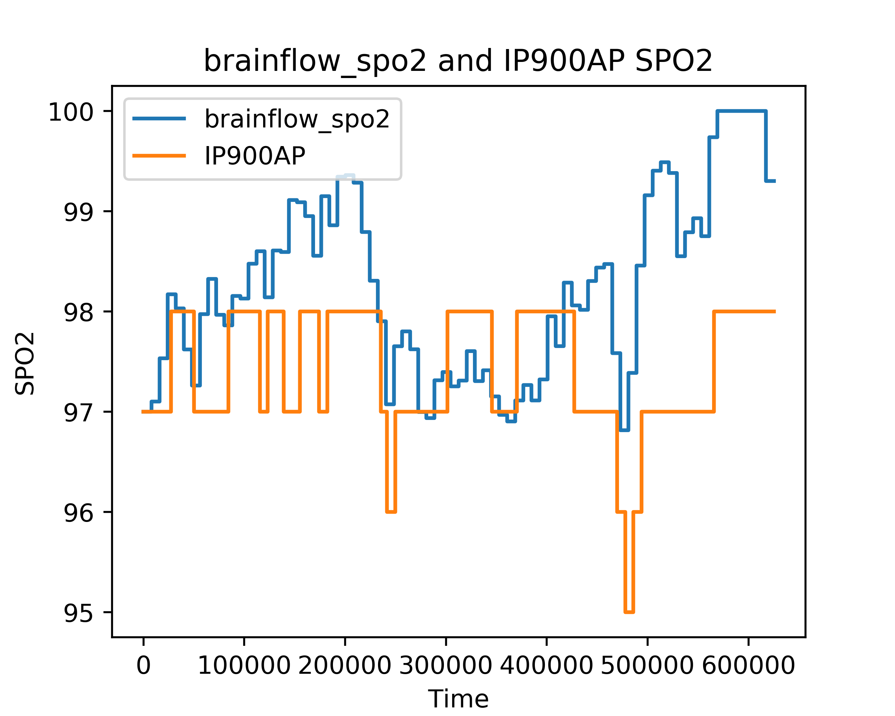

# Description
This algorithm uses PPG-R and PPG-IR data from the EmotiBit to calculate SPO2 level.
# Required Hardware
- Emotibit
# Performance
## [sit-stand-sit_v0.0.0](https://github.com/jaketheduque/Algorithm_Validation/releases/tag/sit-stand-sit_v0.0.0)
Device | Resample Test | Scatterplot
--- | --- | ---
IP900AP |  | 