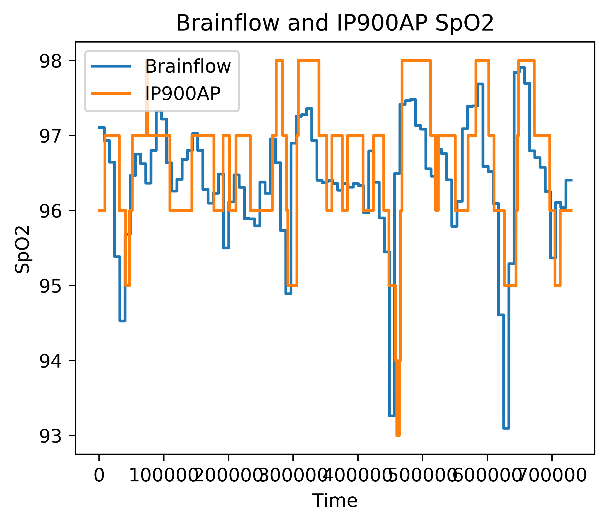

# Description
This algorithm is derived from the Brainflow SpO2 algorithm, and uses PPG-R and PPG-IR data from the EmotiBit to calculate SPO2 level.

# Required Hardware
- Emotibit

# Scripts
## run.py <path_to_data_folder>
Runs the Brainflow algorithm on the provided data folder (which needs to contain a separate .csv file for PPG-R and PPG-IR from the EmotiBit ending in `PR.csv` and `PI.csv`) and saves the calculated SpO2 with timestamps to `generated.csv`. Also shows a plot of the PPG data overlayed with the calculated SpO2.

# Performance
## [sit-stand-sit_v0.0.0](https://github.com/jaketheduque/Algorithm_Validation/releases/tag/sit-stand-sit_v0.0.0)
Device | Resample Test | Scatterplot | Mean-Difference Plot
--- | --- | --- | ---
IP900AP |  |  | 
## [simulated-unobstructed-airway_v0.0.0](https://github.com/jaketheduque/Algorithm_Validation/releases/tag/simulated-unobstructed-airway_v0.0.0)
Device | Resample Test | Scatterplot | Mean-Difference Plot
--- | --- | --- | ---
IP900AP |  |  | 